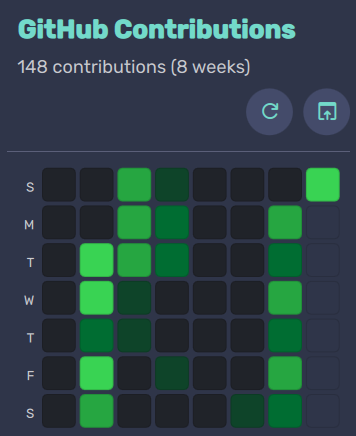

# DMS Plugins

A collection of plugins for [Dank Material Shell](https://github.com/AvengeMedia/dank-material-shell) targeting the niri compositor on Arch Linux.

---

## Plugins

### GitHub Heatmap

Display your weekly GitHub contribution activity directly in your status bar.

**Features**
- Color-coded contribution heatmap (8 weeks)
- Weekly contribution totals
- Manual refresh with notifications
- Open GitHub profile directly from widget

**Settings**
| Setting | Description |
|---------|-------------|
| GitHub Username | Your GitHub username |
| Personal Access Token | Fine-grained PAT with repository read access |
| Refresh Interval | How often to fetch data (seconds) |

**Dependencies**
- curl
- jq
- fish
- libnotify
- xdg-utils

---

### SSH Monitor

Monitor active SSH, SFTP, FTP, and Yazi VFS connections with hostname resolution.

**Features**
- Detects SSH, SFTP, FTP, and Yazi connections
- Resolves hostnames via SSH config
- Real-time connection status
- Connection type indicators

**Settings**
| Setting | Description |
|---------|-------------|
| Refresh Interval | How often to check for connections (seconds) |

**Dependencies**
- fish
- procps-ng
- net-tools

---

### Screenshot Toggle

Toggle niri screenshot mode between saving to disk and clipboard only.

**Features**
- Control center widget
- One-click toggle between modes
- Automatic niri config reload

**Dependencies**
- fish

---

## Requirements

- Compositor: niri
- Distribution: Arch Linux
- Shell: fish

## Installation

Install via the DMS plugin browser.

## Author

Deppes
